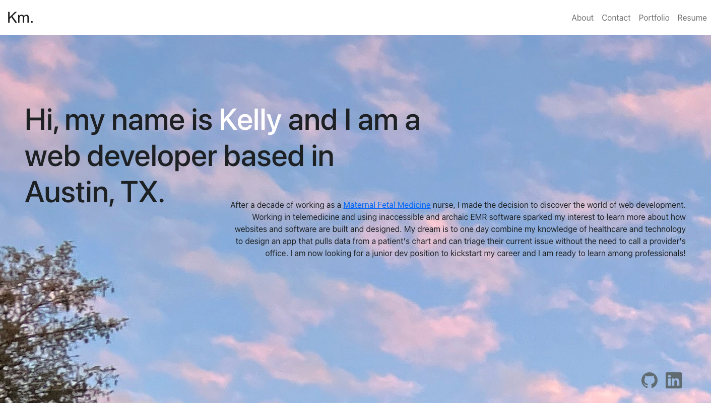

# Personal-Portfolio-using-React

## Table of Contents

* [Description](#description)
* [Screenshot](#screenshot)
* [Installation](#installation)
* [Usage Instructions](#usage-instructions)
* [Technologies Used](#technologies-used)
* [License](#license)
* [Credits](#credits)
* [Future Developments](#future-developments)
 

## Description  

This is a professional portfolio for my previous projects using React, Express, and Bootstrap. 

## Screenshot  

## Installation

Please clone the repository from Github.    
Type `npm i` in the command line to install necessary dependencies. 
  

## Usage instrutions

Run the following command in the root directory of your project to start the server:
  
`npm start`

## Technologies Used    

* React
* React-dom
* React-icons
* Express
* Dotenv
* Bootstrap for CSS framework

## License

MIT License

## Credits

Guidance and support for this project was given by a UT bootcamp tutor and CodeAcademy's React course. 

## Future Developments

Plans in the future for contact form to be fully functioning. 